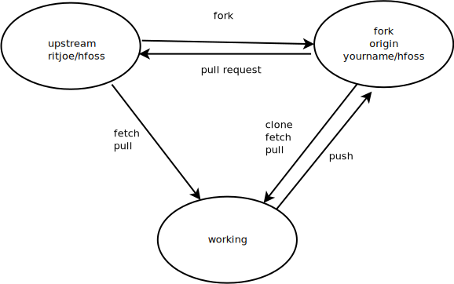

## How to: Git Basics

### Create a new Repository in an Existing Directory
create a new directory, open it and perform a 

    git init
    
to create a new git repository

### Checkout a Repository
create a working copy of a local repository by running 

    git clone /path/to/repository
    
when using a remote server, you use the command

    git clone username@host:/path/to/repository

### Workflow
a local repository consists of three 'trees' maintained by git. The first is the **Working Directory** which holds the actual files. The second one is the **Index** which acts as a staging area and finally the **Head** which points to the last commit. 

### Add & Commit
you can propose changes (adding it to **Index**) using

    git add <filename> 
    git add *
    
to actually commit these changes use

    git commit -m 'commit message: what's that commit about?'
    
now the file is committed to the **Head**, but not in the remote repository yet.

### Pushing Changes
changes are now in the **Head** of your local working copy. To send those chnages to your remote repository, execute

    git push origin master
    
**note:** change *master* to whatever branch you want to push your changes to.

you may want to check the working tree status by using

    git status
    
which will display the state of the working directory and the staging area. It lets you see which changes have been stages, which haven't, and which files aren't being tracked by Git. 

### Branching
branches are used to develop features isolated from each other. The *master* branch is the 'default' branch when you create a repository. Use other branches for development and merge them back to the master branch uppn completion. 

create a new branch named 'feature_x' and switch to it using

    git checkout -b feature_x
    
switch back to master using

    git checkout master
    
delete the branch again using

    git branch -d feature_x
    
a branch is not available to others unless you push the branch to your remote repository
    
    git push origin <branch>
    
### Update & Merge
to update your local repository to the newest commit, execute in your working directory
    
    cd path/to/working-directory
    git pull
    
this will *fetch* and *merge* remote changes.

to merge another branch into your active branch (e.g. master), use

    git merge <branch>
    
in both cases git tries to auto-merge changes. This is not always possible and may results in **conflicts**. Merging those conflicts manually by editing the files shown by git. After changing, you need to mark them as merges with

    git add <file name>
    
before merging changes, you can also preview them by using

    git diff <source_branch> <target_branch>
    
### Upstream and Origin
working with an upstream project through a *fork* of that project requires your working repository to know how to reach two remotes. By cloning your fork of the repository, your fork starts out as the only remote for that clone to work with. This remote uses the default name of **origin**. You will be able to pull and fetch from **origin** to your working repository. You won't be able to push to the original from which you forked.

you can pull (or fetch then merge) from the original repository by configuring it as an additional remote. This convention is to call this remote **upstream**. 

to add the original repository as the remote named **upstream** in your working repository, use 

    git remote add upstream username@host:/path/to/repository
    
you can then issure, for example 

    git pull upstream
    
to bring upstream changes into your repository.

#### Visualizing the above mentiond concepts:

### Log
in its simplest form, you can view a repository history using 

    git log
    
or see only the commits of a certain author by using

    git log --author=jonas
    
to look at more possible parameters use

    git log --help
    
    
### Replace local Changes
in case anything went wrong you can replace local changes using the command

    git checkout -- <filename>

that will replace the changes in your working tree with the last content in **Head**. Changes already added to the **Index** will be kept. 

if you instead want to drop all your local changes and commits, *fetch* the latest history from the server and point your local master branch at it with

    git fetch origin
    git reset --hard origin/master
    

   
    

